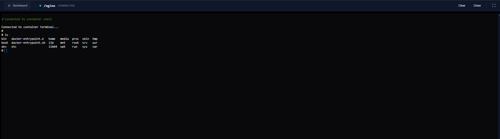
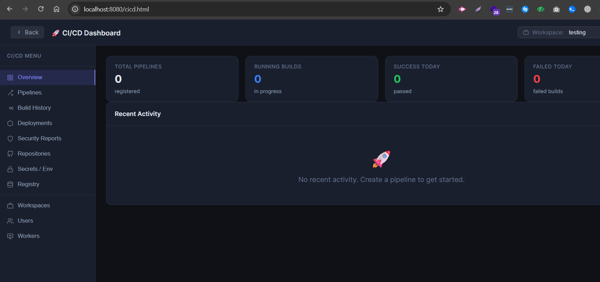
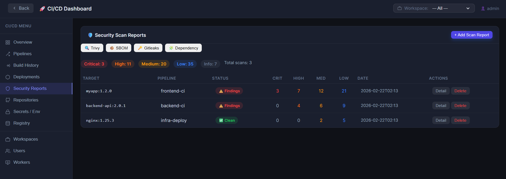
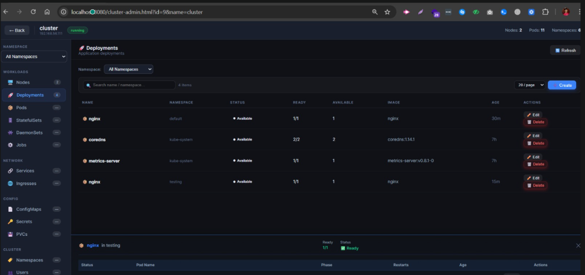
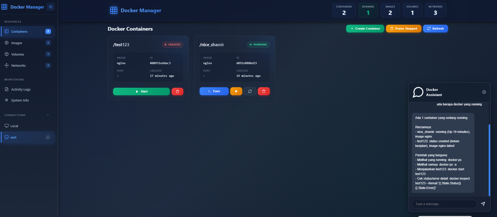
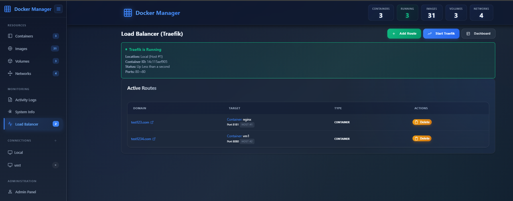

# 🐳 Docker Manager - Modern Web Interface

**Docker Manager** adalah aplikasi web modern dan ringan untuk mengelola container Docker Anda dengan mudah. Dibangun dengan backend Go (Golang) yang cepat dan frontend Vanilla JS yang responsif, aplikasi ini menawarkan pengalaman manajemen Docker yang intuitif tanpa bloatware.


## ✨ Fitur Utama

### 🖥️ Dashboard Futuristik
- **Glassmorphism UI:** Tampilan modern dengan efek transparansi dan animasi halus.
- **Real-time Monitoring:** Pantau status container (Running/Stopped), jumlah image, volume, dan network secara instan.
- **Responsive Grid:** Informasi penting (ID, Image, Port, Created) ditampilkan dengan rapi.

### 🚀 Manajemen Container Lengkap
- **Kontrol Penuh:** Start, Stop, Restart, dan Kill container dengan satu klik.
- **Quick Exec:** Eksekusi perintah langsung ke dalam container tanpa membuka terminal terpisah.
- **Log Viewer:** Lihat log aktivitas container secara real-time.
- **Batch Actions:** Prune container yang tidak digunakan dengan cepat.

### 💻 Terminal Web Canggih
- **Full Screen Mode:** Terminal xterm.js yang terintegrasi penuh, memberikan pengalaman seperti terminal native di browser.
- **WebSocket Connection:** Koneksi real-time yang stabil dan responsif.
- **Fitur Lengkap:** Mendukung copy-paste, command history, dan resizing otomatis.



### 🌍 Multi-Host Support
- **Kelola Banyak Server:** Hubungkan dan kelola multiple Docker Hosts (Local & Remote VM/VPS) dari satu dashboard.
- **Koneksi Aman:** Mendukung koneksi via TCP Socket dan SSH Tunneling.

### 🤖 AI Chatbot Assistant
- **Troubleshooting Pintar:** Diskusikan masalah container Anda langsung dengan AI (OpenAI/Ollama).
- **Context-Aware:** Chatbot otomatis membaca log dan status container untuk memberikan solusi yang relevan.

### ⚖️ Load Balancer (Traefik)
- **Reverse Proxy Otomatis:** Route custom domain (test.com, api.myapp.com) ke container Anda dengan mudah.
- **Multi-Host Support:** Load balance ke container di server lokal maupun remote VM/VPS.
- **Auto-Configuration:** Sistem otomatis mendeteksi IP host dan published port, kemudian generate config Traefik.
- **Zero Downtime Update:** Setiap penambahan/penghapusan route akan otomatis reload Traefik tanpa restart manual.
- **Real-time Status:** Dashboard menampilkan status Traefik (Running/Stopped) dan lokasi containernya.


### 🛠️ Manajemen Resource Lainnya
- **Images:** Pull, Tag, Inspect, dan Hapus Docker Image.
- **Volumes:** Buat dan kelola Volume data persisten.
- **Networks:** Atur konfigurasi jaringan Docker dengan mudah.

### 🚀 CI/CD Pipeline Management


Kelola end-to-end CI/CD pipeline dengan dashboard yang intuitif:
- **Pipeline Creation:** Buat pipeline dengan repository, branch, build command, dan deploy command.
- **Build Worker Support:** Pilih worker atau agent mana yang akan menjalankan build (local atau remote SSH worker).
- **Registry Integration:** Push hasil build otomatis ke registry (Docker Hub, Harbor, ECR) dengan konfigurasi yang fleksibel.
- **Security Scans:** Pilih security scan tools (Trivy, SBOM, Gitleaks, Dependency Check) untuk setiap pipeline.
- **Build History:** Pantau riwayat build, status, dan durasi eksekusi.
- **Multi-Workspace:** Isolasi pipeline per workspace/team dengan permission berbasis role.

### 🔐 Security Scan Reports


Integrasi comprehensive security scanning untuk container dan dependencies:

**Fitur:**
- **Scanner Support:** 4 jenis pemindaian terintegrasi:
  - 🔍 **Trivy:** Container image vulnerability scanning (CVE detection)
  - 📦 **SBOM:** Bill of Materials - track semua dependencies dalam aplikasi
  - 🔑 **Gitleaks:** Secret detection - cari credentials/API keys yang accidentally committed
  - 🧩 **Dependency Check:** Analisis dependency vulnerabilities (npm, pip, maven, dll)

- **Severity Dashboard:** Visualisasi severity counts (Critical, High, Medium, Low, Info) per scan type.
- **Detailed Reports:** Lihat detail penuh scan dengan:
  - Target (image/repo yang di-scan)
  - Pipeline association (linked ke CI/CD pipeline)
  - Detailed findings & raw JSON output
  - Scan status (Clean / Findings / Error)
- **Multi-Tab Interface:** Switch antar scan type dengan satu klik.
- **Add Report Modal:** Manual upload scan reports dari Trivy JSON, SBOM CycloneDX, atau tool lainnya.

### ☸️ Kubernetes (K0s) Cluster Management


Kelola Kubernetes cluster secara langsung dari Dashboard:

**Deployment Management:**
- **List Deployments:** Lihat semua deployment per namespace dengan status (Available, Ready pods).
- **Pod Inspection:** Explore pods dalam setiap deployment - cek nama, status, restart count, age.
- **Create/Edit:** Buat atau modifikasi deployment dengan YAML editor.
- **Delete:** Hapus deployment dengan aman.

**Node Management:**
- **Cluster Nodes:** Lihat daftar nodes dengan info (name, status, ready state, node roles).
- **Resource Capacity:** Monitor CPU, memory allocation dan usage.
- **Node Details:** Inspect individual node untuk troubleshooting.

**Scaling & Updates:**
- **Scale Replicas:** Adjust jumlah replicas di deployment dengan mudah (scale up/down).
- **Rolling Update:** Update deployment dengan strategy (readiness check, termination grace).
- **Deployment History:** Track rollout history dan rollback ke versi sebelumnya jika diperlukan.

**Service & Ingress:**
- **Expose Services:** Create ClusterIP, NodePort, atau LoadBalancer services.
- **Ingress Management:** Setup Ingress untuk HTTP/HTTPS routing ke services.
- **DNS:** Kelola service discovery dan DNS resolution.

**Namespaces & RBAC:**
- **Multi-Namespace Support:** Switch antar namespace untuk isolasi resource.
- **Workspace Integration:** K0s management terintegrasi dengan workspace/team permission system.

## 🛠️ Teknologi yang Digunakan

- **Backend:** Go (Golang) - *Native net/http & Gorilla Mux*
- **Frontend:** HTML5, CSS3 (Modern Variables), Vanilla JavaScript (ES6+)
- **Database:** SQLite (untuk menyimpan konfigurasi Host dan Log Aktivitas)
- **Library:** Docker Go SDK, Xterm.js

## 📦 Cara Install & Menjalankan

### Prasyarat
- Go 1.24+ terinstall
- Docker Daemon berjalan

### Langkah Instalasi

1.  **Clone Repository**
    ```bash
    git clone https://github.com/adisaputra10/docker-management
    cd docker-management
    ```

2.  **Jalankan Aplikasi (Mode Development)**
    
    Menggunakan script (Windows):
    Double click **`start.bat`**

    Atau manual via terminal:
    ```bash
    go run cmd/server/main.go
    ```
    *Aplikasi akan berjalan di `http://localhost:8080`*

3.  **Build untuk Production (Single Binary)**
    
    Aplikasi ini mendukung **Single Binary Build**, artinya frontend (HTML/CSS/JS) sudah tertanam di dalam file `.exe`. Anda cukup mendistribusikan satu file saja!

    Menggunakan script (Windows):
    Double click **`build.bat`**
    
    Atau manual via terminal:
    ```bash
    go build -o docker-manager.exe ./cmd/server
    ```

    Setelah build selesai, jalankan file `docker-manager.exe` dan buka browser di `http://localhost:8080`.

## 🔌 Menghubungkan ke Remote Host (Multi-Server Setup)

Docker Manager mendukung pengelolaan server Docker yang tidak terbatas. Ikuti panduan ini untuk menyiapkan VM atau Server tambahan agar bisa diremote.

### 📝 Langkah 1: Persiapan di Server Remote (VM)

Lakukan langkah ini di setiap server/VM yang ingin Anda kelola:

1.  **Edit Konfigurasi Systemd Docker:**
    Buka file service docker dengan editor teks:
    ```bash
    sudo nano /lib/systemd/system/docker.service
    ```
    Cari baris yang dimulai dengan `ExecStart=` dan ubah menjadi:
    ```bash
    # Expose API Docker di port 2375 (TCP)
    ExecStart=/usr/bin/dockerd -H fd:// --containerd=/run/containerd/containerd.sock -H tcp://0.0.0.0:2375
    ```

2.  **Reload & Restart Docker:**
    Terapkan perubahan konfigurasi:
    ```bash
    sudo systemctl daemon-reload
    sudo systemctl restart docker
    ```

3.  **Verifikasi Port Terbuka:**
    Pastikan Docker sudah listen di port 2375:
    ```bash
    sudo netstat -lntp | grep dockerd
    # Output harus menampilkan: tcp6 0 0 :::2375 ...
    ```

### 🛡️ Langkah 2: Konfigurasi Firewall (Security)

**PENTING:** Membuka port 2375 membuat Docker daemon Anda dapat diakses oleh siapa saja. Pastikan Anda membatasi akses hanya dari IP Manager Anda.

Jika menggunakan **UFW** (Ubuntu/Debian):
```bash
# Izinkan akses HANYA dari IP komputer/server Docker Manager (misal: 192.168.1.10)
sudo ufw allow from 192.168.1.10 to any port 2375 proto tcp
sudo ufw reload
```

### 🔗 Langkah 3: Tambahkan di Dashboard

1.  Buka **Docker Manager** di browser.
2.  Lihat menu **Connections** di sidebar kiri bawah.
3.  Klik tombol **(+) Add Host**.
4.  Masukkan detail server:
    *   **Name:** Nama server (contoh: `Web-Server-01`)
    *   **URI:** Alamat IP server remote (contoh: `tcp://192.168.1.50:2375`)
5.  Klik **Connect**. Server baru akan muncul di daftar dan siap dikelola!


## 🤖 Konfigurasi AI Chatbot (OpenAI / Ollama)

Docker Manager kini dilengkapi dengan asisten AI untuk membantu troubleshooting. Secara default, fitur ini menggunakan API OpenAI, namun Anda dapat mengubahnya ke Local AI (Ollama).


### Cara Mengatur:

1.  Klik ikon **Chat** di pojok kanan bawah layar.
2.  Klik ikon **Settings** (⚙️) di header chat window.
3.  Masukkan konfigurasi API Anda:
    -   **API Key:** Kunci API OpenAI Anda (`sk-...`). Jika menggunakan Ollama, Anda bisa memasukkan dummy text (misal: `ollama`).
    -   **Base URL:** Endpoint API.
        -   Untuk **OpenAI**: `https://api.openai.com/v1` (Default)
        -   Untuk **Ollama** (Local): `http://localhost:11434/v1`
4.  **Save Settings** untuk menyimpan konfigurasi.

*Catatan: API Key disimpan secara aman di database lokal aplikasi Anda.*

## ⚖️ Setup Load Balancer dengan Traefik

Docker Manager menyediakan fitur Load Balancer terintegrasi menggunakan **Traefik v2.10** untuk routing otomatis dari custom domain ke container Anda.



### 🎯 Cara Kerja

Sistem ini bekerja dengan cara:
1. **Traefik Container** berjalan sebagai reverse proxy yang mendengarkan di port 80 (HTTP).
2. Anda menambahkan **Route** yang memetakan domain (misal: `test123.com`) ke container tertentu.
3. Sistem otomatis:
   - Mendeteksi apakah container ada di **local** atau **remote host**
   - Mengambil **published port** dari container
   - Generate konfigurasi Traefik (`traefik_dynamic.yml`)
   - Reload Traefik tanpa downtime

### 📋 Langkah Setup

#### 1. Start Traefik Container

1. Buka menu **Load Balancer** di sidebar.
2. Klik tombol **"Start Traefik"**.
3. Pilih host tempat Traefik akan berjalan (biasanya **Local**).
4. Sistem akan otomatis:
   - Pull image `traefik:v2.10` (jika belum ada)
   - Create Docker volume `traefik-config`
   - Deploy container Traefik dengan port mapping:
     - **Port 80** → HTTP entry point
     - **Port 8081** → Traefik Dashboard

#### 2. Add Route (Mapping Domain ke Container)

1. Klik tombol **"Add Route"**.
2. Isi form:
   - **Domain Name**: Domain yang ingin digunakan (contoh: `test123.com`, `api.myapp.com`)
   - **Select Host**: Pilih host tempat container target berada
   - **Select Container**: Pilih container tujuan dari dropdown
   - **Internal Port**: Port akan otomatis terisi (private port container)
3. Klik **"Add Route"**.

Sistem akan otomatis:
- Generate konfigurasi Traefik
- Copy config ke Traefik container
- Restart Traefik untuk apply perubahan

#### 3. Setup DNS/Hosts File

Agar domain bisa diakses dari browser, tambahkan entry di file hosts:

**Windows:**
1. Buka Notepad as Administrator
2. Edit file: `C:\Windows\System32\drivers\etc\hosts`
3. Tambahkan baris:
   ```
   127.0.0.1    test123.com
   127.0.0.1    api.myapp.com
   ```
4. Save file

**Linux/Mac:**
```bash
sudo nano /etc/hosts

# Tambahkan:
127.0.0.1    test123.com
127.0.0.1    api.myapp.com
```

#### 4. Akses Domain

Setelah setup selesai, buka browser dan akses:
```
http://test123.com
```

Traffic akan otomatis di-route ke container yang sudah Anda konfigurasi! 🎉

### 🔍 Monitoring

Dashboard Load Balancer menampilkan:
- **Status Traefik Container**:
  - Location (host mana Traefik berjalan)
  - Container ID
  - Status (Up/Down)
  - Port mappings
- **Active Routes**:
  - Domain (clickable link)
  - Target container & port
  - Host location

### 🌐 Remote Container Support

Sistem secara pintar mendeteksi routing:

**Scenario 1: Container di Local Host**
```
Domain: app.local → Container: nginx (Local)
Traefik Config: http://host.docker.internal:8080
```

**Scenario 2: Container di Remote Host**
```
Domain: api.myapp.com → Container: backend (VM1 - 192.168.56.111)
Traefik Config: http://192.168.56.111:8080
```

Sistem otomatis menggunakan **IP host + published port** untuk remote containers!

### 🛠️ Troubleshooting

**1. Domain tidak bisa diakses (404)**
- ✅ Pastikan Traefik container running
- ✅ Check file hosts sudah ditambahkan
- ✅ Verifikasi route sudah ter-create di dashboard
- ✅ Test langsung dengan header: `curl -H "Host: test123.com" http://localhost/`

**2. Traefik Dashboard**
- Akses: `http://localhost:8081/dashboard/`
- Lihat routers dan services yang ter-configure

**3. Container target tidak respond**
- Check container target dalam status running
- Verifikasi port mapping sudah benar
- Test akses langsung: `curl http://HOST_IP:PUBLISHED_PORT`


## 🔐 Single Sign-On (SSO) Configuration

Docker Manager supports enterprise-grade authentication using **GitLab** and **Microsoft Entra ID**.

### 1. GitLab SSO Setup
1.  Navigate to your GitLab instance (or GitLab.com) -> **Settings** -> **Applications**.
2.  Create a new application with the `read_user` scope.
3.  Set the **Redirect URI** to: `http://your-server-ip:8080/auth/gitlab/callback` (adjust port/domain as needed).
4.  Copy the **Application ID** and **Secret**.
5.  In Docker Manager, go to **Admin Panel** -> **SSO Settings**.
6.  Enable **GitLab SSO**, paste the credentials, and save.

### 2. Microsoft Entra ID (Azure AD) Setup
1.  Go to **Azure Portal** -> **App registrations** -> **New registration**.
2.  Set the **Redirect URI** (Web) to: `http://your-server-ip:8080/auth/entra/callback`.
3.  Copy the **Application (client) ID** and **Directory (tenant) ID**.
4.  Generate a **Client Secret** in "Certificates & secrets".
5.  In Docker Manager, go to **Admin Panel** -> **SSO Settings**.
6.  Enable **Entra ID**, paste the credentials, and save.

### ⚠️ Standard Login Toggle
You can disable the default username/password login form to force SSO usage.
- Go to **Admin Panel** -> **SSO Settings**.
- Toggle **Standard Login** to OFF.
- **Warning:** Ensure your SSO is working correctly before disabling this to avoid locking yourself out.

## 👥 User Management & RBAC (Role-Based Access Control)

The application implements a strict permission system to separate Administrators from Standard Users.

### Roles and Permissions

| Feature | 👑 Admin | 👤 User |
| :--- | :---: | :---: |
| **User Management** | Create, Edit, Delete Users | ❌ No Access |
| **Project Management** | Create, Assign Users/Resources | View Assigned Projects Only |
| **Docker Hosts** | Add, Connect, Delete Hosts | ❌ No Access |
| **Containers** | Full Control (Start, Stop, Kill, Delete, Exec) | **Restart Only** (Assigned Containers) |
| **SSO Settings** | Configure Providers | ❌ No Access |

### How it Works
1.  **Admins** create Projects (e.g., "Web App A") and assign specific Containers (Resources) to that Project.
2.  **Admins** create Users and assign them to the Project.
3.  **Users** log in and can *only* see the containers within their assigned projects. They are restricted to performing **safe actions** (Restart) to resolve issues without modifying infrastructure.

---

*Dibuat dengan ❤️ untuk komunitas Docker.*
